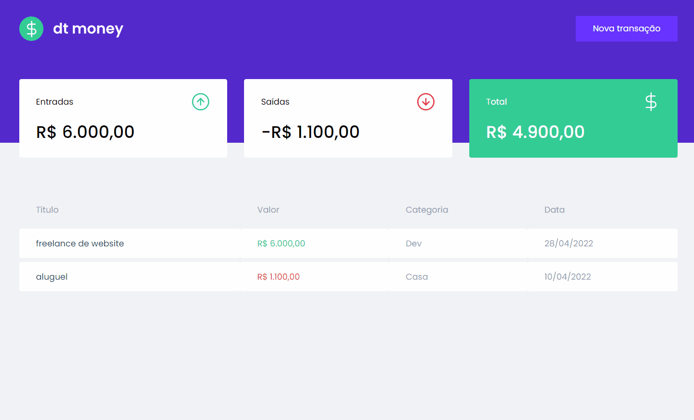

<p align="center">Um site de finanças pessoais onde você pode gerenciar gastos e ganhos, vendo o histórico e o valor acumulado. </p>

## :camera: Demonstração



## :rocket: Tecnologias

## Sobre

Projeto desenvolvido no Capítulo 2 da trilha React do Ignite.

O projeto consiste em uma tabela de transações gerenciadas pelo usuário, onde podemos ver as informações de cada transação e um Sumário onde podemos ver a quantidade de dinheiro adicionado, gasto e total. Possui um botão para adicionar as transações onde é aberto um modal com os inputs para o usuário digitar.

Foram usadas todas boas práticas para construir um projeto escalável e profissional.
A tive muito aprendizado pelas boas práticas, organização de código e lógica usadas pelo Instrutor.

<h3 id="funcionalidades"> ✅ Funcionalidades </h3>

- [x] Cadastrar novas transações;
- [x] Ver o histórico de transações;

<h3 id="tecnologias"/>🛠 Tecnologias </h3>

- Styled Components
- React
- Typescript
- Miragejs

```
# Clone esse repositório
$ git clone https://github.com/mateusx111/dtmoney.git

# Certifique-se de estar no caminho correto do projeto

# Instale as dependências
$ yarn install

# Rode o projeto
$ yarn start
```

